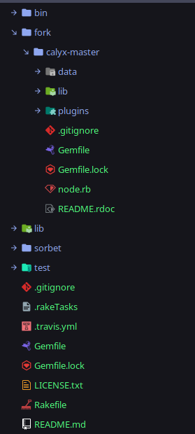
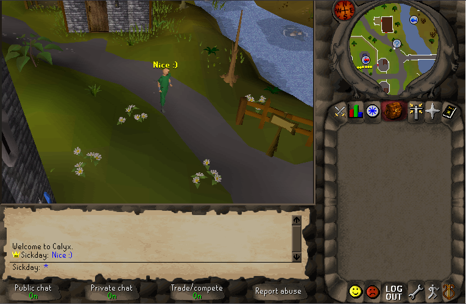

Hi :)

This log is made in an effort to track progress and watch the evolution of my projects. The one I'm focusing on the most right now is RSRS. 


# Preface (Click to skip)

Yeah so, I'm not a programmer. I've got no aspiration to become one and honestly I enjoy doing it exclusively as a hobby. That's not to say I don't want to get better at it; I want to give you an idea of the type of code you're going to see. I'm entirely self-taught and I'm always looking to better myself and the code I write. 

If you feel like something I wrote doesn't make sense, isn't necessary, or could be better **let me know.** This is a huge learning experience for me, and I hope it can be for others as well. When you think it'll help, utilize the feedback button. I'd really appreciate it!

# Humble Beginnings

I love Ruby. 

No cap, it's pretty dope. You can write insanely simple code that does complex things very very easily and it'll read pretty clean.  That's pretty cool.

So imagine my excitement when one day, I stumbled upon 

[this]: https://github.com/calyxrs/calyx

I love RuneScape! I've played it since I was like 7! 

So naturally I had to see if it worked. I threw up a box, installed `rvm` and Ruby 2.6.5. Grabbed `bundler`, and checked out the repo. All seemed simple enough. 

Now the repo doesn't mention it, but in order for this to even be useful, you'll need a client that could theoretically connect to the server. Which means we'll need to dig for one.

I went digging, and found a

[source thread]: https://www.rune-server.ee/runescape-development/rs2-server/downloads/398546-calyx-rs-server-ruby.html


> Basically it's a RS emulator written in Ruby. I ported Hyperion to Ruby and rewrote all of the networking/event code since there are different libraries for it.

Ah. So it's based on Hyperion. Which was written for 

[RuneScape's 317 Protocol]: https://rsps.fandom.com/wiki/317_Protocol

. All I've got to do is "appropriate" a 317 client.


# Ducks are in a row

So I spin up the server (`ruby node.rb`) and check out the output.

I plan to check this out, see how well it runs, and see how we can make improvements. While I'm at it, I'd also want to look at leveraging some of the newer Ruby technologies as this repo hasn't seen an update for 8 (almost 9) years!

It'd also be nice if this were a gem. Imagine if all it took for you to run a server is a simple 

```shell
$ gem install runescape
$ bundle install
$ ruby node.rb
```

That'd be pretty neat. 

How about if it had an API? That'd make the scene a lot more approachable! These are all great ideas, but I figured I should focus on getting a development environment properly setup first. To that end, I whipped up a quick RubyMine project and setup a gem. I've also added in `sorbet` support. If you don't know what that is, it's a type checker for Ruby! It also has some extremely nifty runtime tools that make debugging pretty easy and straightforward. You can learn more 

[here]: https://sorbet.org/

. I've also had a lot of success using `pry` in the past as it allows me to dynamically check 

I created a `fork` directory with the calyx repository inside. This is where all my changes will take place.

 

Looks good to me. Lastly, we probably want to consolidate the dependencies. Calyx's Gemfile looks like so:

```ruby
source :rubygems

gem 'eventmachine',      '~> 0.12'
gem 'sqlite3',           '~> 1.3'
gem 'to_regexp',         '~> 0.1'
gem 'xml-simple',        '~> 1.1'
gem 'rufus-scheduler',   '~> 2.0'
gem 'logging',           '~> 1.3'
```

And here's mine:

```ruby
source "https://rubygems.org"

gemspec

gem 'rake', '~> 12.0'
gem 'minitest', '~> 5.0'
```

Now, I'm pretty sure the only one of these dependencies to have a breaking change in the last 8 years would likely be `rufus-scheduler`  (

[Documented here]: https://github.com/jmettraux/rufus-scheduler/blob/two/README.rdoc

). 

I think we're safe using the latest stable version of the rest of the gems. Here's our new Gemfile

```ruby
source "https://rubygems.org"

gemspec

gem 'rake', '~> 12.0'
gem 'minitest', '~> 5.0'


##
# CALYX DEPENDENCIES

gem 'eventmachine'
gem 'sqlite3'
gem 'to_regexp'
gem 'xml-simple'
gem 'rufus-scheduler',   '~> 2.0'
gem 'logging'
```

Looks good. Lets make sure we can retrieve these gems.

```ruby
Using rake 12.3.3
Using bundler 1.17.3
Using concurrent-ruby 1.1.5
Using eventmachine 1.2.7
Using little-plugger 1.1.4
Using multi_json 1.14.1
Using logging 2.2.2
Using minitest 5.14.0
Using sorbet-runtime 0.5.5284
Using rsrs 0.1.0 from source at `.`
Using tzinfo 2.0.1
Using rufus-scheduler 2.0.24
Using sorbet-static 0.5.5284 (x86_64-linux)
Using sorbet 0.5.5284
Using sqlite3 1.4.2
Using to_regexp 0.2.1
Using xml-simple 1.1.5
Bundle complete! 10 Gemfile dependencies, 17 gems now installed.
Use `bundle info [gemname]` to see where a bundled gem is installed.

```


# Get to the good part

Let's try running it!

Here's our output:

```ruby
/.../ruby-2.6.3/gems/rufus-scheduler-2.0.24/lib/rufus/sc/jobs.rb:322: warning: constant ::Fixnum is deprecated
[2020-01-28T18:00:48] WARN  cache: Cache files not installed! Please place them in the 'data/cache' directory
/.../fork/calyx-master/plugins/effects.rb:1: warning: class variable access from toplevel
/.../fork/calyx-master/plugins/effects.rb:18: warning: class variable access from toplevel
/.../fork/calyx-master/plugins/test.rb:194: warning: class variable access from toplevel
/.../fork/calyx-master/plugins/test.rb:225: warning: class variable access from toplevel
/.../ruby-2.6.3/gems/rufus-scheduler-2.0.24/lib/rufus/sc/jobs.rb:322: warning: constant ::Fixnum is deprecated
[2020-01-28T18:00:48] INFO  server: Ready on port 43594
/.../ruby-2.6.3/gems/rufus-scheduler-2.0.24/lib/rufus/sc/jobs.rb:322: warning: constant ::Fixnum is deprecated
/.../ruby-2.6.3/gems/rufus-scheduler-2.0.24/lib/rufus/sc/jobs.rb:322: warning: constant ::Fixnum is deprecated

```


:unamused:Lots of warnings about `::Fixnum` deprecations. Also got a few class variable usages we should check out. I wonder if we can get rid of these `::Fixnum` warnings. Here's the offending code. Looks like it's part of `rufus-scheduler`'s `jobs.rb` file.

```ruby

  #
  # Job that occurs once, in a certain amount of time.
  #
  class InJob < SimpleJob

    known_params :parent

    # If this InJob is a timeout job, parent points to the job that
    # is subject to the timeout.
    #
    attr_reader :parent

    def initialize(scheduler, t, params)

      @parent = params[:parent]
      super
    end

    protected

    def determine_at

      iin = @t.is_a?(Fixnum) || @t.is_a?(Float) ? @t : Rufus.parse_duration_string(@t) ## <---- OFFENDING LINE.

      @at = (Time.now + iin).to_f
    end
  end
```

more specifically 

```ruby
iin = @t.is_a?(Fixnum) || @t.is_a?(Float) ? @t : Rufus.parse_duration_string(@t)
```

I don't really like to use `Object#is_a?` much. Since Ruby is more Message-based, it'd be better to utilize `Object#respond_to?`. In this particular case, I'd think it to be more effective today to use `Object.class.ancestors.include? Numeric`. The point of this line is to make sure the value of `iin` is either a `Fixnum` or `Float`. These are both children of `Numeric`, while `String` is not. Here's our modification:

```ruby
        if @t.class.ancestors.include? Numeric
          iin = @t
        else
          iin = Rufus.parse_duration_string(@t)
        end
```

A bit longer, but it still gets the job done without throwing warnings and that's good enough for me :thumbsup:.

Now to test our change. Here's our output now:

```ruby
[2020-01-28T18:21:56] WARN  cache: Cache files not installed! Please place them in the 'data/cache' directory
/.../fork/calyx-master/plugins/effects.rb:1: warning: class variable access from toplevel
/.../fork/calyx-master/plugins/effects.rb:18: warning: class variable access from toplevel
/.../fork/calyx-master/plugins/test.rb:194: warning: class variable access from toplevel
/.../fork/calyx-master/plugins/test.rb:225: warning: class variable access from toplevel
[2020-01-28T18:21:56] INFO  server: Ready on port 43594

```


# effects.rb

Those class variable warnings are really annoying as well. Time to take a look. Heres the offending code in `effects.rb`

```ruby
@@effects = [
  {:id => 4079, :hook => :item_click, :anim => 1457}, # Play yo-yo
  {:id => 6865, :hook => :item_click, :anim => 3003, :graphic => 511, :gdelay => 2}, # Jump Marionette(blue)
  {:id => 6866, :hook => :item_click, :anim => 3003, :graphic => 515, :gdelay => 2}, # Jump Marionette(green)
  {:id => 6867, :hook => :item_click, :anim => 3003, :graphic => 507, :gdelay => 2}, # Jump Marionette(red)
        
  {:id => 4079, :hook => :item_click2, :anim => 1460}, # Crazy yo-yo
  {:id => 6865, :hook => :item_click2, :anim => 3006, :graphic => 514, :gdelay => 2}, # Dance Marionette(blue)
  {:id => 6866, :hook => :item_click2, :anim => 3006, :graphic => 518, :gdelay => 2}, # Dance Marionette(green)
  {:id => 6867, :hook => :item_click2, :anim => 3006, :graphic => 510, :gdelay => 2}, # Dance Marionette(red)
      
  {:id => 4079, :hook => :item_alt2, :anim => 1459}, # Walk yo-yo
  {:id => 6865, :hook => :item_alt2, :anim => 3005, :graphic => 513, :gdelay => 2}, # Bow Marionette(blue)
  {:id => 6866, :hook => :item_alt2, :anim => 3005, :graphic => 517, :gdelay => 2}, # Bow Marionette(green)
  {:id => 6867, :hook => :item_alt2, :anim => 3005, :graphic => 509, :gdelay => 2}  # Bow Marionette(red)
]

@@effects.each {|item|
  method("on_#{item[:hook]}").call(item[:id]) {|player, slot|
    if item.include?(:anim)
      player.play_animation Calyx::Model::Animation.new(item[:anim], item[:adelay] || 0)
    end
    if item.include?(:graphic)
      player.play_graphic Calyx::Model::Graphic.new(item[:graphic], item[:gdelay] || 0)
    end
  }
}

```

:scream: Oh dear... 

If we're going strictly by the style guide, this is a bit rough... We'll take this one apart in chunks. Starting with this big Hash.

```ruby
@@effects = [
  {:id => 4079, :hook => :item_click, :anim => 1457}, # Play yo-yo
  {:id => 6865, :hook => :item_click, :anim => 3003, :graphic => 511, :gdelay => 2}, # Jump Marionette(blue)
  {:id => 6866, :hook => :item_click, :anim => 3003, :graphic => 515, :gdelay => 2}, # Jump Marionette(green)
  {:id => 6867, :hook => :item_click, :anim => 3003, :graphic => 507, :gdelay => 2}, # Jump Marionette(red)
        
  {:id => 4079, :hook => :item_click2, :anim => 1460}, # Crazy yo-yo
  {:id => 6865, :hook => :item_click2, :anim => 3006, :graphic => 514, :gdelay => 2}, # Dance Marionette(blue)
  {:id => 6866, :hook => :item_click2, :anim => 3006, :graphic => 518, :gdelay => 2}, # Dance Marionette(green)
  {:id => 6867, :hook => :item_click2, :anim => 3006, :graphic => 510, :gdelay => 2}, # Dance Marionette(red)
      
  {:id => 4079, :hook => :item_alt2, :anim => 1459}, # Walk yo-yo
  {:id => 6865, :hook => :item_alt2, :anim => 3005, :graphic => 513, :gdelay => 2}, # Bow Marionette(blue)
  {:id => 6866, :hook => :item_alt2, :anim => 3005, :graphic => 517, :gdelay => 2}, # Bow Marionette(green)
  {:id => 6867, :hook => :item_alt2, :anim => 3005, :graphic => 509, :gdelay => 2}  # Bow Marionette(red)
]
```


I'm not really sure why this is declared as a Class variable outside of an actual Class, but we can change this into an instance variable instead. This makes more sense as only one instance exists for each server process.

 Additionally, we should make this adhere to the new hash format: `key: value` vs the use of the rocket `key => value`. Here's what we've got.

```ruby
@effects = [
  {id: 4079, hook: :item_click, anim: 1457}, # Play yo-yo
  {id: 6865, hook: :item_click, anim: 3003, graphic: 511, gdelay: 2}, # Jump Marionette(blue)
  {id:  6866, hook: :item_click, anim: 3003, graphic: 515, gdelay: 2}, # Jump Marionette(green)
  {id:  6867, hook: :item_click, anim: 3003, graphic: 507, gdelay: 2}, # Jump Marionette(red)
        
  {id:  4079, hook: :item_click2, anim: 1460}, # Crazy yo-yo
  {id:  6865, hook: :item_click2, anim: 3006, graphic: 514, gdelay: 2}, # Dance Marionette(blue)
  {id:  6866, hook: :item_click2, anim: 3006, graphic: 518, gdelay: 2}, # Dance Marionette(green)
  {id:  6867, hook: :item_click2, anim: 3006, graphic: 510, gdelay: 2}, # Dance Marionette(red)
      
  {id:  4079, hook: :item_alt2, anim: 1459}, # Walk yo-yo
  {id:  6865, hook: :item_alt2, anim: 3005, graphic: 513, gdelay: 2}, # Bow Marionette(blue)
  {id:  6866, hook: :item_alt2, anim: 3005, graphic: 517, gdelay: 2}, # Bow Marionette(green)
  {id:  6867, hook: :item_alt2, anim: 3005, graphic: 509, gdelay: 2}  # Bow Marionette(red)
]
```

Not bad. I can't help but feel there's a better way to represent this type of data. I don't like that we have hashes with these hard-coded values given to them to represent these effects. We'll have to come back to this later.

On to the next chunk:

```ruby
@@effects.each {|item|
  method("on_#{item[:hook]}").call(item[:id]) {|player, slot|
    if item.include?(:anim)
      player.play_animation Calyx::Model::Animation.new(item[:anim], item[:adelay] || 0)
    end
    if item.include?(:graphic)
      player.play_graphic Calyx::Model::Graphic.new(item[:graphic], item[:gdelay] || 0)
    end
  }
}
```

We can definitely find a better way to do this. For the moment, we'll make the small improvement of consolidating all this logic into a simple block

```ruby
[{id: 4079, hook: :item_click, anim: 1457}, # Play yo-yo
 {id: 6865, hook: :item_click, anim: 3003, graphic: 511, gdelay: 2}, # Jump Marionette(blue)
 {id:  6866, hook: :item_click, anim: 3003, graphic: 515, gdelay: 2}, # Jump Marionette(green)
 {id:  6867, hook: :item_click, anim: 3003, graphic: 507, gdelay: 2}, # Jump Marionette(red)

 {id:  4079, hook: :item_click2, anim: 1460}, # Crazy yo-yo
 {id:  6865, hook: :item_click2, anim: 3006, graphic: 514, gdelay: 2}, # Dance Marionette(blue)
 {id:  6866, hook: :item_click2, anim: 3006, graphic: 518, gdelay: 2}, # Dance Marionette(green)
 {id:  6867, hook: :item_click2, anim: 3006, graphic: 510, gdelay: 2}, # Dance Marionette(red)

 {id:  4079, hook: :item_alt2, anim: 1459}, # Walk yo-yo
 {id:  6865, hook: :item_alt2, anim: 3005, graphic: 513, gdelay: 2}, # Bow Marionette(blue)
 {id:  6866, hook: :item_alt2, anim: 3005, graphic: 517, gdelay: 2}, # Bow Marionette(green)
 {id:  6867, hook: :item_alt2, anim: 3005, graphic: 509, gdelay: 2}  # Bow Marionette(red)
].each do |item|
  method("on_#{item[:hook]}").call(item[:id]) do |player, slot|
    if item.include?(:anim)
      player.play_animation Calyx::Model::Animation.new(item[:anim], item[:adelay] || 0)
    end
    if item.include?(:graphic)
      player.play_graphic Calyx::Model::Graphic.new(item[:graphic], item[:gdelay] || 0)
    end
  end
end
```

I feel really dissatisfied looking at this, but we can focus on improving this when the time comes. There's likely far more important code needing some TLC than the effects for Marionettes. 


# test.rb

I'm going off the assumption this file was used for it's namesake; testing. As such, it seems a lot of the code is there to quickly test certain features. The vast majority of the code are commands adhereing to the following format:

```ruby
on_command("command_label") {|player, params|
	... # code
}
```

Looks like this project already has a degree of meta-programming added to support "plugins". While that's cool, I think it can definitely be expanded upon. But again, this can be touched on more later. The offending line is here:

```ruby
@@emotes = {
  161 => 860,
  162 => 857,
  163 => 863,
  164 => 858,
  165 => 859,
  166 => 866,
  167 => 864,
  168 => 855,
  169 => 856,
  170 => 861,
  171 => 862,
  172 => 865,
  13362 => 2105,
  13363 => 2106,
  13364 => 2107,
  13365 => 2108,
  13366 => 2109,
  13367 => 2110,
  13368 => 2111,
  13383 => 2127,
  13384 => 2128,
  13369 => 2112,
  13370 => 2113,
  11100 => 1368,
  667 => 1131,
  6503 => 1130,
  6506 => 1129,
  666 => 1128,
}

@@emotes.each {|button, anim|
  on_int_button(button) {|player|
    player.play_animation Calyx::Model::Animation.new(anim)
  }
}
```

Looks to be a similar offense to `effects.rb`. Heres our modified version. Again, not perfect, but gets the job done a little better than it did before.

```ruby
{161 => 860,
 162 => 857,
 163 => 863,
 164 => 858,
 165 => 859,
 166 => 866,
 167 => 864,
 168 => 855,
 169 => 856,
 170 => 861,
 171 => 862,
 172 => 865,
 13362 => 2105,
 13363 => 2106,
 13364 => 2107,
 13365 => 2108,
 13366 => 2109,
 13367 => 2110,
 13368 => 2111,
 13383 => 2127,
 13384 => 2128,
 13369 => 2112,
 13370 => 2113,
 11100 => 1368,
 667 => 1131,
 6503 => 1130,
 6506 => 1129,
 666 => 1128,
}.each do |button, anim|
  on_int_button(button) do |player|
    player.play_animation Calyx::Model::Animation.new(anim)
    end
end
```

Now to give it a whirl:

```ruby
[2020-01-28T18:51:45] WARN  cache: Cache files not installed! Please place them in the 'data/cache' directory
[2020-01-28T18:51:45] INFO  server: Ready on port 43594

```


Let's get a Client up and running and see if we can get connected!



```ruby
[2020-01-28T19:26:59] DEBUG net: 1 connections now from 127.0.0.1
[2020-01-28T19:26:59] DEBUG net: Connection opened
[2020-01-28T19:26:59] DEBUG net: Connection type: client
[2020-01-28T19:26:59] DEBUG net: Username: sickday
[2020-01-28T19:26:59] INFO  profile: Retrieving profile: sickday
```


This is pretty sweet. 

